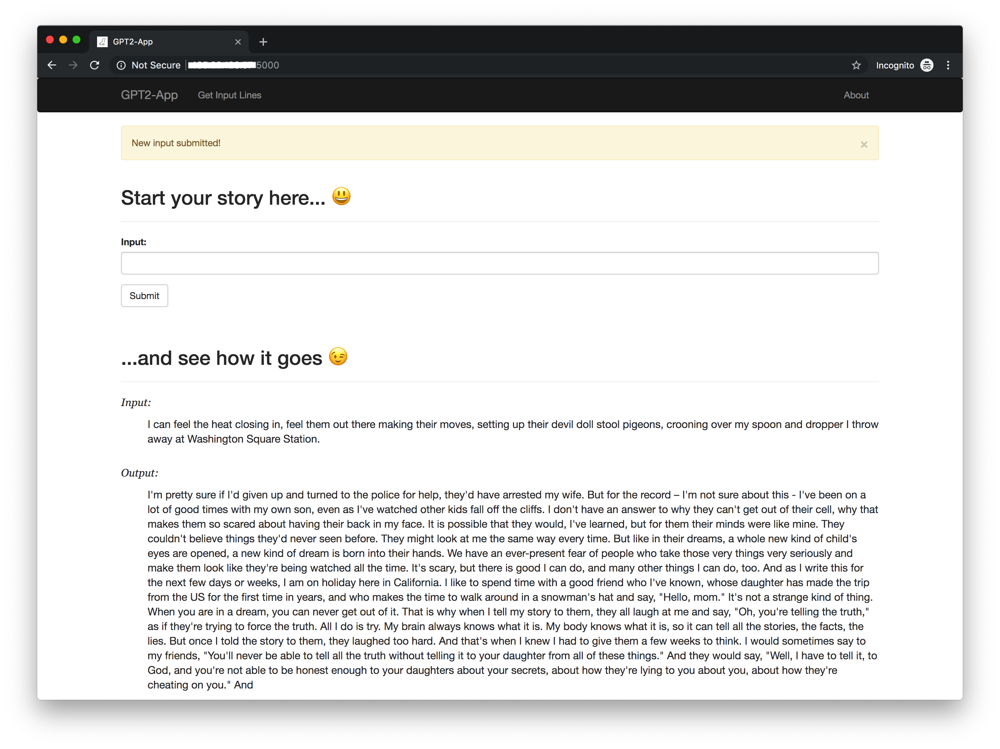

## A Flask Web App for Generating Stories Given Opening Lines with [GPT-2](https://github.com/openai/gpt-2)

GPT-2, a very large language model hyped as too dangerous to release its full version, can generate realistic text close to human level based on its input. The authors decided to release only a "less capable" (117M parameter) version. 

Set the controversy aside, let's take a look around and see what the smaller model can do with this app. Submitted an initial text, the app will continue the story, and hopefully, take you on a wild ride. Buckle Up. :P

- - - 


### Demo


This is a snapshoot of the app currently deployed on a [Docker](https://www.docker.com/) container hosted on my personal development Ubuntu server on [DigitalOcean](https://www.digitalocean.com/) with limited resources. You can setup and run one wherever Docker is enabled.

- - -

### Usage
1. Clone the repository.
    ```
    $ git clone git@github.com:jingw222/gpt2-app.git
    ```

2. Build a new Docker image.
    ```
    $ docker build -t gpt2-app:0.1-py3 --rm .
    ```

3. Run the app in a container.
    ```
    $ docker run -p 5000:5000 --name gpt2-app gpt2-app:0.1-py3
    ```

4. Navigate to the page on a browser where the app is hosted. (e.g. `127.0.0.1:5000` for local deployment, or `ip:5000` for remote servers)

- - -

### Future work

I may integrate it with some public APIs, like Reddit and Twitter, and do some fun staff. 

- - -

### License

[MIT](https://github.com/jingw222/gpt2-app/blob/master/LICENSE)


